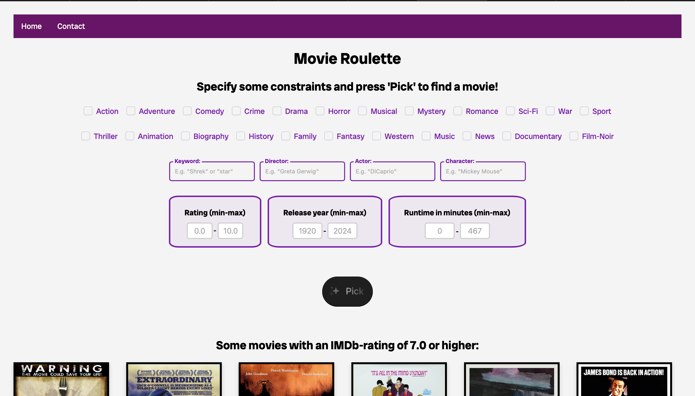

# Movie Roulette

Welcome to Movie Roulette! In our web-app, you can find movies based on
* genres,
* title keywords,
* directors,
* actors,
* characters,
* IMDb-rating,
* runtime, and
* release year.

If any movie matches your criteria after you’ve clicked **Pick**, you can press **Pick another** to find other movies that match your criteria, or press **Update criteria** if you want to change your previously specified criteria. If you want to completely reset your criteria, press **Home** in the upper right corner.

## Running the project
1. Create a database with the name **MovieRoulette** and possibly update line 7 in `app.py` to match your local database configurations.
2. To install the required modules, run the command

```
pip install -r requirements.txt
```

3. In your terminal/command line, navigate to the `movieroulette` directory with the `cd` command.
4. Change the paths in the `COPY-FROM` statements in `create_basic_tables.sql` and `create_relationship_tables.sql` to the correct paths. After doing this (assuming that you have added the `psql` command to your path), run the following commands in your terminal/command line:

```
psql -d MovieRoulette < create_basic_tables.sql
psql -d MovieRoulette < create_relationship_tables.sql
```

5. To run the web-app, run
```
python3 app.py
```
### Notes
If run on Windows, there may be issues with file permissions. 
If such an error should occur then visit the following website under section 1 to resolve the issue:
https://www.makeuseof.com/windows-11-fix-access-denied-error/.
Please note that you should add a new user called "everyone" after the last step.
